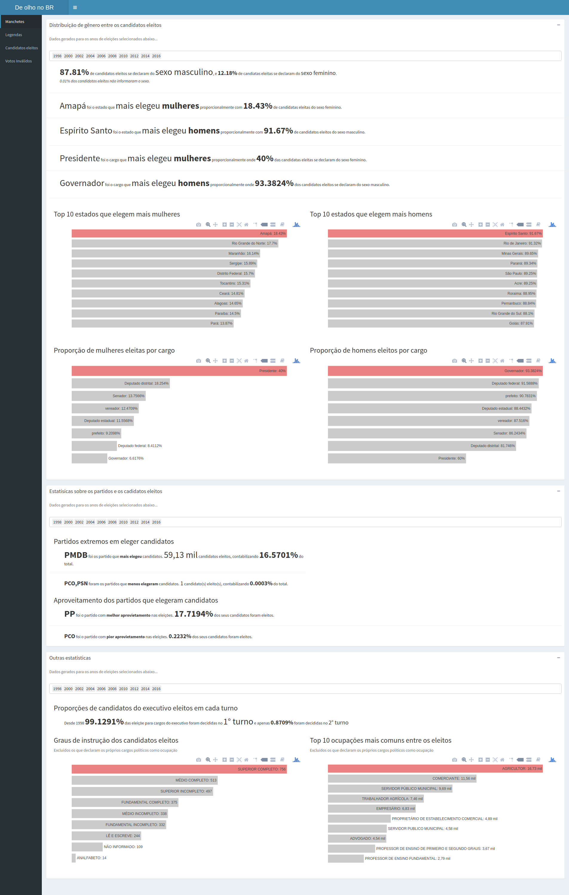
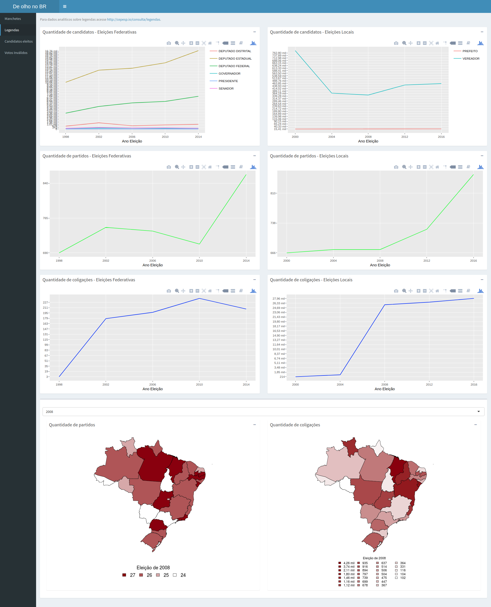
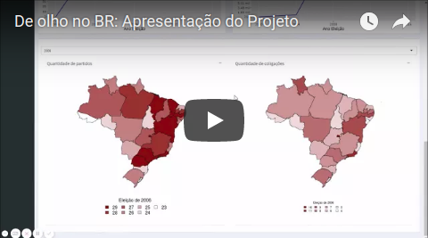

# De olho no BR: plataforma de visualização de dados eleitorais brasileiros

**De olho no BR** é uma plataforma para visualização de dados eleitorais brasileiros onde o usuário pode navegar em um portal web com diversos painéis compostos por variados tipos de gráficos, além de gerar manchetes com base em alguns filtros pré-estabelecidos.

A plataforma gera uma cache com os dados fornecidos pela api do [CEPESP](http://cepesp.io/), e a partir desta cache realiza diversas consultas e agregações que são os dados de entrada para criação dos painéis e das manchetes.

### Requisitos

 - Ubuntu 16.04.3 LTS 64-bit
 - R >= 3.4.2
 - PostgreSQL >= 9.6.6
 - As bibliotecas do R necessárias para cada um dos subprojetos está detalhada nas respectivas documentações, conforme links abaixo.

### Esta plataforma é composta por dois componentes principais

 - Serviço de atualização de cache: [Confira a documentação aqui](./atualizacao-cache/README.MD).
 - Portal Web: [Confira  a documentação aqui](./web-app/README.MD).
 
 
# Funcionalidades
O portal **De olho no BR** é composto por quatro painéis de visualização de dados:
 1. **Manchetes:** Informações geradas para o público comum, para o navegador que entra nos sites de notícias para verificar informações interessantes sobre as eleições: como o partido que mais elege candidatos ou o cargo que mais elege mulheres. Para todas as informações o usuário pode selecioar um ou mais eleições específicas.
 2. **Legendas**: Painel detalhado sobre quantidade de candidatos em cada cargo ao longo dos anos, assim como quantidade de legendas e coligações. Esse painel também mostra em um mapa como essas informações estão distribuídas ao longo das 17 unidades federativas brasileiras.
 3. **Candidatos eleitos:** Mostra a quantidade de votos que elegeu cada cargo ao longo das eleições. Neste painel é possível comparar informações sobre os votos nos cargos e localidades (estados, cidades).
 4. **Votos inválidos:** Série temporal que exibe a evolução dos votos inválidos(brancos, nulos e abstenções) ao longo das eleições brasieliras. Este painel também mostra como os votos inválidos estão distribuídos nas 27 unidades federativas brasileiras.
 
 Abaixo seguem *screenshots* das 4 funcionalidades citadas
 
### Manchetes

 
### Legendas

### Candidatos eleitos

### Votos inválidos

# Apresentação do Projeto
A seguir um vídeo com a apresentação do projeto

